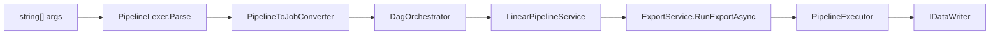

# CLAUDE.md

This file provides guidance to Claude Code (claude.ai/code) when working with code in this repository.

> **Docs map:** end-user CLI/YAML syntax, flag semantics, and recipes live in [README.md](./README.md), [COOKBOOK.md](./COOKBOOK.md), and [REFERENCE.md](./REFERENCE.md) — this file covers internals only (call chains, class ownership, invariants) and links out rather than restating them.

## Language

All code, comments, commit messages, and documentation **must** be written in English. This is a hard requirement — no exceptions.

> **Not enforced** — no check exists. Discipline only.

## Comments

A comment documents the code **as it is now**: what it does, what contract it must honour, what breaks if the next person changes it. It is not a changelog.

**Do not write the code's biography.** Cut anything whose subject is a past state or an editing decision — *"used to"*, *"previously"*, *"the old behaviour"*, *"this was renamed because"*, *"the point of naming it is"*. That history already lives in git, `.notes/` and `CHANGELOG.md`; a second copy in the source only rots and buries what a reader actually needs.

**One narrow exception — the deterrent.** Naming a past failure is justified when it stops a *specific* future mistake. `ComponentSelector`'s "reimplemented at seven sites, the copies drifted" and `DuckDbConnectionHelper`'s "the defensive re-check made `duck:memory` create a FILE named memory" both earn their place: a maintainer who removes the guard reproduces the bug. **Test to apply: name the mistake the comment prevents.** If you cannot, it is a story — delete it.

Also cut:

- **Restating the signature** — `<returns>` paraphrasing `<summary>`, or a `<remarks>` that repeats both.
- **Rhetorical emphasis** — *"the whole point"*, *"and that is the finished state"*.
- **Worked examples and figures** that belong in a test or the changelog.
- **Enumerating what another component owns.** A list of other providers' names, prefixes or strategies is stale the day one is added or renamed, and nothing verifies it. Point at the live source instead (`dtpipe providers`, the enum itself). Two such lists have already been removed after going wrong.
- **Citing a planning document.** `.notes/` is gitignored, so `voie 4 §6 lot E2b` names a file no clone can open, and it tells a reader nothing to act on. Names the repository *does* carry stay legal — `F16`, `F1`–`F7`, `REFERENCE.md#dag-syntax`. The test is not whether it reads like a citation but **whether a clone can open it**. Forty-four such references accumulated across one cycle before a check existed.

Length is not the measure — `DagOrchestrator`'s broadcast description and `ArrowSchemaSerializer`'s type-encoding table are long and earn every line. Subject is the measure.

> **Enforced by** `tests/scripts/validate_comments.sh` (CI) — for the last bullet only. "Does this comment cite something a clone cannot open" *is* decidable by a grep, which is why that one now has a check. **Not enforced** for the rest: "does this comment prevent a mistake" is not, and no check is plausible. Discipline only.

## Commits

Subject: conventional commit, imperative, one line. **The body is short by default** — a sentence or two on what changed and why it had to change. Length is earned, never the default: a breaking change or a deleted subsystem may take a paragraph, most changes take none.

**A body is not a delivery report.** Test counts, "0 warning", the steps followed, what was verified, what was checked afterwards — none of it belongs in a message. That record lives in `.notes/` and `CHANGELOG.md`, and `git show --stat` already answers "what did this touch".

> **Not enforced** — no check exists. Measured drift over cycle 1.7: median body of **19 lines**, against **3** for the 60 commits preceding it. Discipline only.

## Build & Run

Prefer `./build.sh` for a full build (runs unit tests + produces a self-contained binary in `dist/release/`):

```bash
./build.sh
```

For targeted builds during development:

```bash
dotnet build DtPipe.sln
dotnet run --project src/DtPipe -- --help
dtpipe --help
```

## Testing

Prefer `./test_local.sh` for integration tests — it reuses persistent Docker containers instead of spinning up new ones via Testcontainers (much faster):

```bash
./test_local.sh
./test_local.sh --filter "FullyQualifiedName~SomeTest"
```

For unit tests only (no Docker required):

```bash
dotnet test tests/DtPipe.Tests/DtPipe.Tests.csproj --filter "FullyQualifiedName~.Unit."
dotnet test tests/DtPipe.Tests/ --filter "FullyQualifiedName~PipelineLexerTests"
```

`test_local.sh` sets `DTPIPE_TEST_REUSE_INFRA=true` to connect to fixed-port containers started by `tests/infra/start_infra.sh`. Use `tests/infra/stop_infra.sh` to tear them down. Shell-based integration scripts are also in `tests/scripts/`.

### Performance Gate

Three tiers, all local — none run in CI:

| Tier | What | Where | Threshold |
|---|---|---|---|
| Micro | `tests/scripts/micro_perf_gate.sh` — BenchmarkDotNet in-process on the hot conversion paths, no infra | Local only, reference machine, before an engine change | Wide (detects a ×2) |
| Macro complete | 15 scenarios incl. Oracle / SQL Server | Local only, `experiments/dtpipe-sandbox` | 15 % |
| Macro light | file↔file + PostgreSQL subset | Optional, nightly, only if micro proves insufficient | Wide |

Micro ran in CI once, on 2026-09-05, comparing the reference-machine baseline against
a GitHub-hosted runner via `--allow-foreign-host`: 30 of the 31 committed benchmarks
came back flagged as regressions, all between +111 % and +201 %, purely from machine
identity — the very first push exercising the job. GitHub gives no stability
guarantee on shared runner performance, so the gap is not a one-off: a threshold wide
enough to survive it stops being a gate at all, and a tighter one is guaranteed red
on unrelated hardware, teaching contributors to ignore the job rather than trust it.
Removed from `build.yml` the same day. Same reasoning macro complete already used to
justify staying local — applied here only after being learned the expensive way once.

**A baseline records the machine it was measured on, and the gate refuses to compare
across two different ones** (exit 2, no verdict) rather than render a misleading one.
`--allow-foreign-host` still exists for a deliberate, informed cross-machine check —
it is not wired into any CI job.

Update the micro baseline with `./tests/scripts/micro_perf_gate.sh --update` on the
reference machine, and only when a change is a deliberate, understood shift.

### Engine Change Obligations

Any change to `DagOrchestrator` **must** be covered in `DagOrchestratorTests.cs`, and any change to `LinearPipelineService` in `OrderedPipelineTests.cs`. Both validate without the CLI.

Before committing engine changes, verify the three canonical cases:
1. Linear pipeline (single branch, no memory channel)
2. Two-branch DAG (independent branches)
3. DAG with SQL processor (`--from` + `--sql`)

Golden DAG fixtures in `GoldenDagDefinitions.cs` are the canonical shapes, consumed by the engine suites (`DagOrchestratorTests`, `ChannelInjectionTests`, `EngineInvariantsTests`, `JobDagDefinition_JsonTests`). The CLI side — args → DAG — is covered separately by `PipelineLexerTests` and `PipelineToJobConverterTests`. Add a new topology → add a golden definition + round-trip test in `JobDagDefinition_JsonTests.cs`.

> **Enforced by** those suites (CI). **Not covered:** nothing ties CLI arguments to the golden shapes — the engine and the parser are guarded, the bridge between them is not — and nothing verifies that a change to `DagOrchestrator` or `LinearPipelineService` arrives with a test. That obligation is discipline.

## Architecture Overview

### Solution Structure

| Project | Role |
|---|---|
| `src/DtPipe` | CLI entry point, DI wiring, `JobService`, `ExportService`, MCP server, AI Agent |
| `src/DtPipe.Core` | Abstractions, DAG engine, pipeline models, helpers |
| `src/DtPipe.Adapters` | Readers and writers for all data sources/targets |
| `src/DtPipe.Transformers` | Row and columnar data transformers |
| `src/DtPipe.Processors` | C# side of SQL stream processors (DuckDB, factories) |
| `src/Apache.Arrow.Ado` | Standalone ADO.NET → Arrow library; zero DtPipe deps (depends on `Apache.Arrow.Serialization` only) |
| `src/Apache.Arrow.Serialization` | Standalone CLR↔Arrow type map + POCO serializer; zero DtPipe deps, no external deps beyond `Apache.Arrow` |
| `tests/DtPipe.Tests` | xunit.v3 unit and integration tests |

File placement: `DtPipe.Core` = abstractions/models/engine only. Each transformer in `DtPipe.Transformers` lives in its own subdirectory (`Row/Expand/`, `Arrow/Filter/`…) with matching sub-namespace. Each stream processor in `DtPipe.Processors` follows the same pattern (`DuckDB/`, `Merge/`…). Readers/writers under `DtPipe.Adapters/Adapters/<Name>/`. AI Agent classes under `src/DtPipe/Cli/Agent/`.

### Core Data Flow



`DagOrchestrator` spawns this same chain once per branch, concurrently — even a single-branch (linear) run goes through it once. Fundamental pipeline: `IStreamReader` → `IDataTransformer[]` → `IDataWriter`.

1. `JobService.BuildSubcommands()` registers named subcommands (`inspect`, `providers`, `completion`, `secret`, `mcp`, `agent`) into `System.CommandLine`.
2. `FlagRegistryFactory.Build(serviceProvider)` assembles a `FlagRegistry` from `[ComponentOption]` providers + stream processor trigger flags. `PipelineLexer.Parse(args)` → `ParsedPipeline` (`BranchSpec[]`). `PipelineToJobConverter.Convert(parsed, …)` → `(Dictionary<string, JobDefinition>, JobDagDefinition)`.
3. Linear: `LinearPipelineService` → `ExportService.RunExportAsync()` → `PipelineExecutor`.
4. DAG: `DagOrchestrator` spawns concurrent `Task`s per branch via `Channel<T>` for zero-copy data flow. The kernel is `PipelineExecutor.ExecuteSegmentedPipelineAsync`.

### Provider Pattern

Every adapter implements `IProviderDescriptor<TService>` and is registered in `Program.cs` via `RegisterReader<T>()` / `RegisterWriter<T>()` / `RegisterStreamTransformer<T>()`. `CliProviderFactory<T>` wraps descriptors: `CliOptionBuilder.GenerateFlagDefsForType(OptionsType)` reflects on `[ComponentOption]` → `FlagDef` entries. At execution `FlagBinder.Bind(optionsInstance, args, registry)` maps CLI args to the options object. Provider options live scoped in `OptionsRegistry` (keyed by type).

#### Connection selectors are invisible to providers (non-negotiable)

`ComponentSelector` (`DtPipe.Core.Abstractions`) is the **single authority** on the `{component}[+{variant}]:` grammar. It is the only place allowed to know that prefixes exist.

- **No adapter may test for its own prefix.** `CanHandle` receives the RAW string and must judge by *content* only — file extension (`.duckdb`, `.csv`) or connection-string keywords (`Host=`, `Data Source=`). See the warning on `IDataFactory.CanHandle`. A prefix test there hands the provider a string the router never stripped.
- **Every routing site goes through `ComponentSelector`** — `LinearPipelineService.ResolveFactory`, `InspectCommand`, `DtPipeMcpTools.Analyze` (×3), `PipelineToJobConverter`, `ProviderConfigurationService`, `DagRenderer`. Hand-rolling `StartsWith(ComponentName + ":")` is how the URI rule below ended up fixed in one site and broken in three.
- **A remote URI is never a selector.** The grammar ends in `(?!//)`, so `s3://bucket/key.parquet` is not read as an `s3:` prefix and reaches the provider intact. This is a property of the grammar, not a guard each caller must remember.
- **Variants reach the provider as data, not as text to re-parse.** `ComponentSelector` splits `duck+mysql:Host=…` into variant `mysql` + details `Host=…`; the router puts the variant on `ConnectionRoute.InputVariant`/`OutputVariant`, and `CliProviderFactory` pushes it onto options implementing `IVariantAwareOptions`. The selector owns the *syntax*; which variants are valid stays the provider's business (`DuckHubConnectionParser`) — and as of the native `mysql:` provider its allowlist is empty, so the grammar still parses `duck+mysql:` while the provider rejects it. That split is the point: a retired variant is a provider decision, not a grammar change.

> **Enforced by** `ComponentSelectorTests` and `RemoteUriClaimTests.No_Component_Selector_Strips_A_Remote_Uri`, both CI, the second catalog-wide — a new provider is covered without editing the test. **Not covered:** a routing site that bypasses `ComponentSelector` entirely; only the sites that use it are verified.

### DAG Pipeline

`PipelineLexer` (`DtPipe.Cli.Pipeline`) tokenises args into `ParsedPipeline` (`BranchSpec` with `ReaderArgs`/`PipelineArgs`/`WriterArgs`). Three tokens trigger an implicit branch split:
- `-i` / `--input` — when an input or job file was already seen in the current branch
- `--from <alias[,alias...]>` — when a `--from`, `--input`, or `--job` was already seen; first `--from` in a fresh branch stays in current branch
- `--job` / `-j <file>` — when a job file or input was already seen

Neither `--sql` nor boolean processor flags (e.g. `--merge`) trigger a split. Each processor declares trigger flags via `IStreamTransformerFactory.CliTriggerFlags`.

Canonical processor grammar (see `REFERENCE.md#dag-syntax` for per-flag semantics, topologies, and examples — not restated here):

```
--from <alias[,alias...]> [--ref <alias[,alias...]>] (--sql "<query>" | --<processor>) [--alias <name>] [-o <dest>]
```

**An alias list is always comma-separated, and repeating a flag never accumulates.** Repetition has
exactly one meaning in this grammar — `-i`, `--from` and `--job` open a new branch — so a value flag
that also grew on repeat would teach that `--from a --from b` adds a source when it starts a second
branch. Every other value flag is scalar and rejects a second occurrence in the same stage.

How many aliases `--from` accepts is the **processor's** business, not the grammar's: `--merge` takes
several, `--sql` takes exactly one and materializes the rest through `--ref` (each factory validates
its own arity). The `[,alias...]` above is therefore permitted by the syntax, not by every processor.

- `--job <file>` / `-j <file>` loads a YAML pipeline job file; `PipelineToJobConverter` reads it and applies any additional CLI flags as overrides.
- `--export-job <file>` serializes the current CLI pipeline to a YAML job file via `JobFileWriter` and exits without running the pipeline.

Branches communicate via `IMemoryChannelRegistry` (`Channel<IReadOnlyList<object?[]>>` or Arrow `Channel<RecordBatch>`). Fan-out (broadcast/tee) is resolved via `BranchChannelContext.AliasMap` (logical alias → physical channel including `s__fan_0` sub-channels), populated by `DagOrchestrator` and consumed directly by factories (e.g. `DuckDBSqlTransformerFactory.cs:71`).

> `--ref` is intentionally materialized (cost-based query planning) — rationale and per-flag semantics: `REFERENCE.md#dag-syntax`.

### SQL Processors

`CompositeSqlTransformerFactory` is the DI entry point for `--sql` branches. The default (and currently only) engine is DuckDB — `DuckDBSqlTransformerFactory` / `DuckDBSqlProcessor`: zero-copy Arrow C Data Interface on read (`--from`), lazy streaming fetch (`duckdb_execute_prepared_streaming` + `duckdb_fetch_chunk`) on write, schema inferred from the prepared statement before execution. `DuckHubConnectionParser` parses `duck+{provider}:` connection strings and auto-issues `INSTALL`/`LOAD`/`ATTACH`. `--retry` uses Polly v8 (`DatabaseRetryPolicy`). `--duck-init`/`--compute`/`--expand` value resolution goes through `IStringContentResolver` (`CliStringContentResolver` for the CLI, `DefaultStringContentResolver` for headless contexts). The init-SQL runner is duplicated verbatim between `DuckInitSqlHelper` (Adapters) and a private `RunInitSqlAsync` (Processors) — Processors can't reference Adapters, so don't add a third copy; if consolidating, promote it to a neutral shared location instead. User-facing flag syntax and examples: `REFERENCE.md#provider-specific-options`, `COOKBOOK.md#sql-processors-and-joins`.

### Transformer Pipeline

`IDataTransformer` has `InitializeAsync` (schema), `Transform` (per-row), `Flush` (end-of-stream). `PipelineSegmenter` groups consecutive columnar-capable transformers into segments for Arrow zero-copy bridging between row and columnar modes.

### Key Interfaces

- `IStreamReader` / `IColumnarStreamReader` — open + stream batches
- `IDataWriter` / `IRowDataWriter` / `IColumnarDataWriter` — write contracts
- `IDataTransformer` / `IDataTransformerFactory` — row transforms
- `IStreamTransformerFactory` — multi-input processors; `Create(branchArgs, ctx, serviceProvider)` receives `BranchChannelContext` for alias resolution
- `ICliContributor` / `OptionsRegistry` — CLI contribution + scoped option store

### Sample mode — there is no second engine

`--dry-run N` is **the real execution over N source rows with the writer neutralised**. Same
reader, same transformers, same segmentation, same row↔columnar bridges. There is no analyser
beside `PipelineExecutor`, and adding one back is the mistake this section exists to prevent.

There was one, and the two disagreed: `DryRunAnalyzer` walked rows through
`IDataTransformer.Transform`, so a `--window` pipeline reported every row as dropped
(`WindowDataTransformer.Transform` returns `null`) while the run wrote aggregates via
`TransformMany` + `Flush`, and `--expand` reported one row of every N.

Three pieces, and only the first touches the engine:

- **`ISampleTap`** — an observation point offered each stage's output where `ReportTransform` is
  already called. Read-only, and forbidden from disposing or retaining a `RecordBatch`. Stage 0 is
  the reader, 1..n the transformers in pipeline order.
- **`SampleModeSink`** — two decorators selected by the real writer's **capability**, the shape
  `CursorTracking{Row,Columnar}Decorator` already uses. Mirroring matters: the engine reads
  row-vs-columnar mode off `writer is IColumnarDataWriter`, so a sink of the wrong kind changes
  the segmentation and the bridge count — substituting `null:` (row-only) is exactly that mistake.
- **`SampleRun`** — the capture, read by both the renderer and the checkpoint store. One run, one
  report, two presentations.

Sample mode also suppresses `ValidateAndMigrateAsync` (it can CREATE/ALTER the target), **all four
hooks** (they are SQL on the target connection), the cursor and the metrics file.

> **Enforced by** `SampleModeEquivalenceTests` (CI) — what a sample reports must equal what a real
> run writes, over pipelines that expand, aggregate and pass through — plus
> `tests/scripts/validate_single_engine.sh`, which is a grep and says so in its own header: it
> catches a second execution loop written in plain sight or a renderer fetching its own rows, not
> a call made by reflection. **Not covered:** a transformer whose semantics the parameterised
> cases do not exercise.

### Sample-mode safety is a read-side problem

Neutralising the writer is a claim about the **writer**. A reader can mutate: `DELETE … RETURNING`,
`… OUTPUT`, `--duck-init`, an `ATTACH` inside `--sql` — and `--limit` bounds what the client reads,
never what the server already destroyed. `SampleModeSafetyGate` classifies the **resolved**
pipeline's source SQL (so a `@file` query is covered, unlike the YAML text scan) and
`ISqlDialect.ReadOnlySessionSql` lets the server refuse instead of a regex guessing.

Writer hooks are deliberately **not** classified: they are already suppressed, so refusing a
pipeline for carrying one adds no safety and teaches people to pass `--allow-destructive` by
reflex — which would then unlock the source side too.

SQL Server returns `null` for `ReadOnlySessionSql` — `ApplicationIntent=ReadOnly` routes to a
replica, it does not make a session read-only. The report says which guarantee the run had. **A
guarantee that is sometimes absent must never be reported as though it were always there.**

> **Enforced by** `SampleModeSafetyGateTests` (CI) and `tests/scripts/validate_sample_safety.sh`.
> **Not covered:** a query that writes through a function — `SELECT my_function()` passes a verb
> scan, which is why the server-enforced form exists and why the weaker one is reported as weaker.

### Checkpoints are addressed by content, and always encrypted

`--checkpoint` tees the columnar stream into the session store; `--from-checkpoint` reads it back.
The key is a hash of the branch prefix's **definition** (sanitised connection, query, transformers,
sampling parameters) — never the alias — so two pipelines in one directory cannot collide and an
unchanged prefix is reused.

Encryption has **no opt-out**, and the reason is structural rather than cautious: what AES-GCM buys
is not confidentiality at rest (the key is on the same disk) but two properties of the **store as a
whole** — an inert copy, and a purge made reliable by destroying the key. Both are properties of the
store, so one cleartext session would void them for every other session in it, retroactively. Cost
measured at ~3.5–4 GB/s (~24 ms per 100 MB).

`--from-checkpoint` resolves by capability and **never** through `ComponentSelector`: a checkpoint
key is a hex string, and letting it into the `{component}[+{variant}]:` grammar is how a key would
one day be read as a prefix.

**A row-mode pipeline gets a bridge, not a refusal.** When materialising and the last segment is
not columnar, `ExecuteSegmentedPipelineAsync` appends an *empty* columnar segment — the device the
engine already uses for a row reader feeding a columnar writer — so the chain reaches Arrow at the
writer boundary, tees, and bridges back. Refusing CSV→CSV was not defensible: it is the commonest
shape there is, and refusing did not avoid the Arrow round-trip, since resuming reads Arrow
anyway. The segment is added **only** when `materialise is not null`, so an ordinary run does not
see one extra branch.

> **Enforced by** `CheckpointCipherTests`, `CheckpointKeyTests`, `CheckpointRoundTripTests` (CI)
> and `tests/scripts/validate_checkpoint.sh` (local, real binary).

## Debug Mode

```bash
DEBUG=1 dtpipe --input pg:"..." --output csv:out.csv
```
Verbose branch-level logging to stderr.

## Exit Codes

`0` = success · `1` = fault · `130` = user cancellation (Ctrl-C, POSIX SIGINT convention).

Cancellation never masks as success (F16): `LinearPipelineService` discriminates the dedicated user token from internal cancellation sources and returns 130 on user shutdown; internal cancellation propagates. In DAG runs, a branch reporting 130 makes `DagOrchestrator` cancel the rest and return 130. The only intentional cancellation-swallowing site is `DagOrchestrator.ExecuteBranchAsync`'s orphaned-producer path (returning 0 is normal fan-out operation when consumers complete).

> **Enforced by** `tests/scripts/validate_cancellation.sh` (F16), local — it drives real interrupts, so it needs a live process rather than a unit test.

## Pipeline Design Principles

### No magic conversions in the engine core

The engine (Core, Processors, DAG orchestrator) must **never** perform implicit type conversions to work around an adapter limitation. Adapter-specific behavior belongs in the adapter.

When a type mismatch arises (e.g. CSV `string` UUID vs Parquet `FixedSizeBinary(16)` UUID), prefer in order:
1. **Adapter parameterization** — e.g. `--column-type "Id:uuid"` on CSV reader
2. **Pipeline transformer** — e.g. `--compute` to parse the string column
3. **SQL processor** — e.g. `CAST(base64_decode(id) AS UUID)` in `--sql`

Forbidden:
- Detecting a source format and silently converting in a type mapper/schema factory
- Changing `ArrowTypeMapper` / `PipeColumnInfo` to compensate for an adapter
- Branching in `ExportService`/`PipelineExecutor`/`DagOrchestrator` on adapter identity

> **Partly enforced.** `tests/scripts/validate_core_boundary.sh` keeps concrete SQL/dialect/cursor classes out of `DtPipe.Core`. **Not covered:** the three bullets above — no check looks for a branch on adapter identity inside the engine. Discipline.

Canonical UUID: `FixedSizeBinaryType(16)` + Field metadata `ARROW:extension:name = arrow.uuid`, RFC 4122 big-endian (`ArrowTypeMapper.ToArrowUuidBytes` / `FromArrowUuidBytes`).

### Representation rules are named for themselves, not for Arrow

Two conventions are needed **outside** Arrow as well — a database `BINARY(16)` column wants RFC 4122
byte order, and a row-mode DB parameter needs the same temporal rule — so each lives under its own
name in `Apache.Arrow.Serialization/Mapping/`, with the Arrow-facing spellings delegating to it:

| Rule | Owner | Arrow-facing spelling |
|---|---|---|
| RFC 4122 big-endian byte order | `Rfc4122Guid.ToBigEndianBytes` / `FromBigEndianBytes` | `ArrowTypeMap.ToArrowUuidBytes` / `FromArrowUuidBytes` |
| Zone-less `DateTime` handling | `TemporalNormalization.ToOffset` / `ToWallClock` | called directly by `ArrowTypeMap.GetValue` and the readers |

**`TemporalNormalization` owns both directions on purpose.** A `DateTime` with
`Kind=Unspecified` is a wall clock with no zone; `new DateTimeOffset(dt)` and
`TimestampArray.Builder.Append(DateTime)` both resolve it against `TimeZoneInfo.Local`, which put
the machine's time zone inside the data path — the same rows produced different bytes in Paris and
in Tokyo, sometimes on a different calendar day. The write and read halves drifted apart once
already; keeping them in one class is the fix's whole point, and they must be changed together.

Guarded by `validate_core_boundary.sh` (no `new DateTimeOffset(` outside the rule) and
`validate_temporal.sh` (the real binary under two `TZ` values must produce identical output).

### RecordBatch ownership (columnar path)

Arrow buffers are off-heap (`NativeMemoryAllocator`) and reference-counted. A `RecordBatch` that
nobody disposes is not a leak the GC reports — it is native RSS the GC cannot see, reclaimed only
when the finalizer eventually runs. So the columnar path has one rule:

**Every `RecordBatch` has exactly one owner. The owner calls `Dispose()` exactly once, then never
touches it. Ownership moves downstream when the batch is yielded, returned, or written.**

- A **reader** / **row→columnar bridge** produces batches and hands each one to its consumer.
- `PipelineExecutor.ApplyColumnarSegmentAsync` owns every batch it pulls from its source. It
  disposes that input after the transformer chain has run — **unless the transformer returned the
  same reference** (`ReferenceEquals`), which means pure pass-through and the one object is still
  the live batch. It does **not** dispose what it yields; the next segment or the writer owns that.
- An `IColumnarTransformer` that returns a **new** `RecordBatch` reusing any input column buffer
  **must** wrap that column in `ArrowOwnership.RetainArray(...)`. Without the retain, the segment
  runner's dispose of the input frees buffers the output still points at (use-after-free). The
  six transformers that alias columns — Project, Mask, Overwrite, Null, Format, Fake — all do this.
- The **writer** takes ownership via `WriteRecordBatchAsync` (its interface doc says so) and
  disposes.
- `BridgeColumnarToRowsAsync` is a terminal consumer: `using (batch)`.
- **Fan-out** (`DagOrchestrator` broadcast): the broadcaster owns the upstream batch, gives each of
  N consumers an independent batch via `ArrowOwnership.RetainAll` (refcount bump, not a deep
  `Clone`), then disposes its own reference. Each consumer disposes the batch it received.

> **Enforced by** `ArrowOwnershipTests` (CI) — `TrackingMemoryPool` asserts allocations return to
> zero after a linear chain and after a fan-out where one branch bridges to rows. **Not covered:**
> a new transformer that aliases a column without retaining it — no check distinguishes an aliased
> array from a rebuilt one. Discipline, plus the `RetainArray` call reads as the obvious idiom next
> to the five that already have it.

## Apache.Arrow.Serialization

Standalone library with no DtPipe deps (only `Apache.Arrow`):

```
Apache.Arrow.Serialization ← standalone
       ↑ 
Apache.Arrow.Ado          ← uses ArrowTypeResult
       ↑
DtPipe.Core               ← ArrowTypeMapper is facade over ArrowTypeMap
```

`ArrowTypeMap` (`Mapping/ArrowTypeMap.cs`) is the canonical CLR↔Arrow map; `ArrowTypeMapper` in Core is a facade. `FixedSizeBinaryArrayBuilder` lives only in `Apache.Arrow.Serialization/Reflection/FixedSizeBinaryArrayBuilder.cs` — Core consumes it via project reference (single definition). See `EXTENDING.md` for `ArrowSerializer`/`ArrowDeserializer` usage.

> **Enforced by** `tests/scripts/validate_core_boundary.sh`, which fails on any `using DtPipe.` or project reference to DtPipe from either standalone Arrow library. **Note:** `tests/Apache.Arrow.Serialization.Tests` is **never run by `build.sh`**, which only executes `tests/DtPipe.Tests --filter ".Unit."` — `dotnet test DtPipe.sln` in CI is the only thing that runs it, so a regression here is invisible to a local `./build.sh` before push.

## Adding a New Adapter

See `EXTENDING.md` for full patterns. Key rules:
- **Row writers**: build `ColumnConverterFactory.Build(sourceClrType, targetClrType)` once per column at init; never per-cell `ValueConverter.ConvertValue()`.
- **Columnar writers**: implement `IColumnarDataWriter`; use `ArrowTypeMapper.GetValueForField(array, field, i)` when a `Field` is available.
- **Text readers**: implement `IColumnTypeInferenceCapable` for `--auto-column-types`.

> **Not enforced** — nothing checks that a writer builds its converters per column rather than per cell, nor that a text reader opts into inference. Both are performance and capability defaults a new adapter silently loses. Discipline only.

### Arrow ↔ CLR mapping: no heuristics

`ArrowTypeMapper.GetClrType(IArrowType)` never infers semantic type from storage alone (`FixedSizeBinary` → `byte[]`). Use `GetClrTypeFromField(Field)` (checks extension metadata).

Key APIs:
- `GetLogicalType(Type)` → `ArrowTypeResult` (`.ArrowType` + `.Metadata`)
- `GetField(name, clrType, nullable)` → `Field` with metadata — use instead of `new Field(...)`
- `GetClrTypeFromField(Field)` / `GetValueForField(array, field, i)` — metadata-aware (e.g. `arrow.uuid` → `Guid`)
- `GetClrType(IArrowType)` / `GetValue(array, i)` — storage-only

> **Not enforced** — no check distinguishes a legitimate storage-only call from one that should have been metadata-aware. Round-trip behaviour is covered indirectly (`ArrowAdapterTests`, `validate_temporal.sh`), which catches the symptom, not the wrong call. Discipline only.

## MCP Server & Agentic Integration

`dtpipe mcp` (STDIO) exposes schema-discovery, validation, and execution tools for AI assistants (`execute-yaml-job` is dry-run by default). Don't enumerate tool names here — see `REFERENCE.md#mcp-server` (canonical, up-to-date tool table) and `REFERENCE.md#agent-guardrails` for full options. `dtpipe agent` runs an interactive loop with Ollama/OpenAI (`AgentExecutor`, `AgentTui`, `OllamaClient`).

Hardening invariants (F1–F7, fail-closed, non-negotiable — details in `REFERENCE.md#agent-guardrails`):
- **F1 Planner/Executor split** — `--mode plan` (default) hides `execute-yaml-job` from the model.
- **F2 Guardrails** — `ISqlSafetyPolicy` (destructive verbs / network) + `IApprovalGate`; `apply` + approval + clean check required for writes.
- **F3 Determinism** — `temperature 0 + seed` and `--repeat N`; `DeterminismReport` variance = distinct-YAML − 1.
- **F4 Non-destructive context** — fact cache + `ConversationWindowManager.Compact`.
- **F5 Parallel tools** — all `ToolCalls` per turn executed (`Task.WhenAll`; `--sequential` forces serial).
- **F6 Single YAML path** — `yamlContent` tool arg is sole plan source.
- **F7 CI gate** — `tests/agentic/analyze-traces.sh --gate` fails on unhandled MCP errors or a failed mission. Its variance criterion applies only when `variance_results.jsonl` holds real replication data; the shipped missions drive their own bash ReAct loop against `dtpipe mcp` and never invoke `dtpipe agent --repeat`, so they produce none. Never record a placeholder variance to fill the file — a criterion that cannot fire is worse than an absent one. The authoritative signal for F1–F7 is the deterministic unit suite (`Unit/Cli/Agent*Tests`, `Unit/Cli/Mcp*Tests`), not this gate.

Mandatory MCP directives:
1. No hardcoded help — reflect on `[Description]`/`[ComponentHelp]`. *(Not enforced: nothing tests `GetGeneralHelp`. The adapter and transformer lists it prints are derived from the factories, so they cannot drift — but a hardcoded block added elsewhere would pass unnoticed.)*
2. In-memory execution via `JobFileParser` + `JobService.ExecutePipelineAsync()` — no temp files/shell proxies. *(Not enforced — discipline.)*
3. Auto table discovery on `inspect` without a query, plus actionable hints on validation errors. *(Not enforced — discipline.)*
4. Fail-closed — default `apply=false`, reject on ambiguity. *(Enforced by `ExecuteYamlJobGuardrailTests`, CI.)*

### Writing adapter help (`[Description]` / `[ComponentHelp]`)

`get-adapter-help` is the only view a model gets of an adapter, so these attributes are a contract, not decoration.

- **Say what reflection cannot.** Option names, types and descriptions are already emitted from the properties. `usageNotes` exists for what they cannot convey: prerequisites (MySQL bulk needs `local_infile=ON` server-side), silent fallbacks, and semantics that make an option dangerous — `--strategy Upsert` requires a PRIMARY KEY or UNIQUE index covering the key columns, or MySQL appends duplicates instead of updating. **An option a model can set without knowing its failure mode is worse than one it cannot see.**
- **Reader and writer each carry their own attributes, and both are emitted.** The writer's is not a redundant copy of the reader's — it is where write semantics live.
- **The component's own side of an example stays concrete; the counterpart side is a placeholder** (`<adapter-prefix>:<target>` / `<source>`). Naming a real adapter anchors the model on an unrelated component, and a verbatim copy silently writes a file nobody asked for — where a placeholder fails closed with "No writer factory resolved". The one exception is `generate:` ↔ `null:`, where the pairing itself is the lesson.
- **Name the driver and say the key list is open.** ADO.NET fixes the `Key=Value` form but not the vocabulary, so there is no single specification to point at: the option set belongs to the provider's driver (Npgsql, MySqlConnector, …). Naming it is what lets a model reach past the keys shown, and steers it away from a different driver's options.

`McpAdapterHelpTests` enforces the mechanical half over the whole catalog — both roles present, counterpart placeholders, driver named. The first point is the one only a human can honour.
