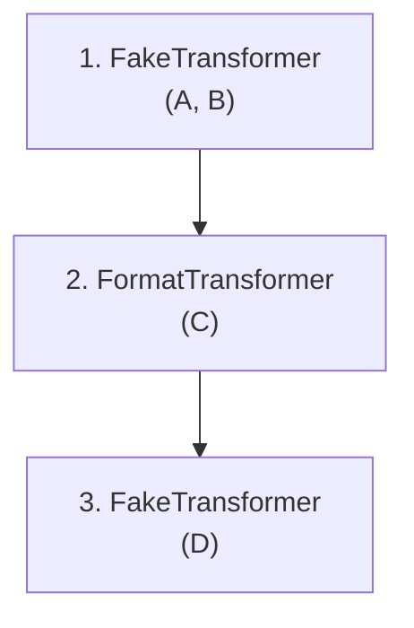

# DtPipe Cookbook 🍳

This document contains recipes and examples for using DtPipe to solve common data export and transformation problems.

**Table of Contents**
- [Basic Usage](#basic-usage)
- [Anonymization (The "Fakers")](#anonymization-the-fakers)
- [Common Transformations](#common-transformations)
- [Advanced Pipelines](#advanced-pipelines)
- [Standard Streams & Linux Pipes](#standard-streams--linux-pipes)
- [Database Import & Migration](#database-import--migration)
- [Production Automation (YAML)](#production-automation-yaml)

---

## Basic Usage

### Simple Database Export
Export a table from a database (detects `duck`, `sqlite`, `pg`, `ora`, `mssql`) to a Parquet file.

```bash
# Export from PostgreSQL to Parquet
./dist/release/dtpipe -i "pg:Host=localhost;Database=prod;Username=postgres" -q "SELECT * FROM users" -o users.parquet
```

### Export to CSV
Simply change the output extension to `.csv`.

```bash
./dist/release/dtpipe -i "pg:Host=localhost;Database=prod;Username=postgres" -q "SELECT * FROM users" -o users.csv
```

### Dry Run (Preview)
Use `--dry-run [LIMIT]` to preview data without writing a full file.

```bash
./dist/release/dtpipe -i "pg:Host=localhost;Database=prod;Username=postgres" -q "SELECT * FROM users" --dry-run 100
```

---

## Anonymization (The "Fakers")
 
DtPipe maps your configuration directly to [Bogus Datasets](https://github.com/bchavez/Bogus?tab=readme-ov-file#locales).
 
**Resources:**
- [Available Locales](https://github.com/bchavez/Bogus?tab=readme-ov-file#locales)
- [API Inventory (Datasets)](https://github.com/bchavez/Bogus?tab=readme-ov-file#locales)
 
### 1. General Usage
The syntax is `--fake "{Column}:{Dataset}.{Method}"`, where `Dataset.Method` corresponds exactly to the Bogus API.

#### Personal Information
Replace names and emails with culturally appropriate fake data.
 
```bash
./dist/release/dtpipe ... \
  --fake "FirstName:name.firstName" \
  --fake "LastName:name.lastName" \
  --fake "Email:internet.email" \
  --fake-locale fr
```
 
#### Dates and Numbers
Generate other types of data using the same mechanism.
 
```bash
./dist/release/dtpipe ... \
  --fake "BirthDate:date.past" \
  --fake "Score:random.number"
```
 
### 2. Deterministic Faking
DtPipe provides a special **Deterministic Mode** that guarantees referential integrity across tables.
 
Unlike standard seeding (which restarts the sequence), this mode uses a **stable hash** of a specific column (e.g., `UserId`) to generate the fake value.
 
- If `UserId=123` becomes "Alice", it will **always** become "Alice", even if the row order changes or if you run the export again next month.
- This allows you to anonymize `Users` and `Orders` tables separately while maintaining the foreign key relationships (provided they both use the same fake seed).
 
```bash
./dist/release/dtpipe ... \
  --fake "Name:name.fullName" \
  --fake-seed-column "UserId"
```

---

## Common Transformations

Simple, high-performance transformers for cleaning and shaping data.

### 1. Masking Sensitive Strings
Partially hide data instead of fully replacing it.

```bash
# Turns "555-0199" into "555-****"
./dist/release/dtpipe ... --mask "Phone:###-****"

# Masking patterns:
# # - Keep original character
# * - Replace with literal '*' (or any other char)
```

### 2. Overwriting & Nullifying
Hardcode values or erase sensitive columns.

```bash
# Force "Status" to "Archived" and "Notes" to NULL
./dist/release/dtpipe ... \
  --overwrite "Status:Archived" \
  --null "Notes"
```

### 3. Formatting Strings
Combine columns using [.NET Composite Formatting](https://learn.microsoft.com/en-us/dotnet/standard/base-types/composite-formatting) syntax.

```bash
# Create "DisplayName" from First and Last names
./dist/release/dtpipe ... --format "DisplayName:{FirstName} {LastName}"
```

---

## Advanced Pipelines

Chain multiple transformers to clean and shape your data.

### Pipeline Construction
DtPipe builds the pipeline by scanning your CLI arguments from left to right.
Crucially, **consecutive** arguments of the same type (e.g., multiple `--fake` flags) are grouped into a single transformation step.


**Example:**
`--fake A --fake B --format C --fake D`

**Resulting Pipeline:**



This means:
- `--fake "A" --fake "B"` creates **one** Faker step (efficient).
- `--fake "A" --format "C" --fake "B"` creates **three** steps (A -> Format -> B).

### Execution Order
**Crucial:** The pipeline is executed in the **exact order** of these groups.

```bash
# 1. First, anonymize the Name
# 2. Then, use the NEW (anonymized) name to format the greeting
./dist/release/dtpipe ... \
  --fake "Name:name.fullName" \
  --format "Greeting:Hello, {Name}!"
```

If you swap the order, the `Greeting` would contain the *original* name, because formatting would happen before faking.

### Javascript Scripting
Use `--script` for complex logic.

**Syntax Rules:**
1.  **Implicit Return**: If your script is a single expression without a semicolon, it is automatically returned.
    *   `row.Age > 18` -> Becomes `return row.Age > 18;`
2.  **Explicit Return**: If you use statements or semicolons, you **MUST** use the `return` keyword.
    *   `row.Age > 18;` -> Returns `undefined` (Use `return`!)
    *   `if (row.Age > 18) return 'Yes';` -> Works.

```bash
# Simple Expression (Implicit Return)
./dist/release/dtpipe ... --script "IsAdult:row.Age > 18"

# Complex Logic (Explicit Return)
./dist/release/dtpipe ... \
   --script "Category:if (row.Age < 18) return 'Minor'; else return 'Adult';"
```

---

## Standard Streams & Linux Pipes

Integrate DtPipe with standard Unix tools using `stdin`/`stdout`.

### Zipped Parquet Output
Read a CSV natively and compress the output on-the-fly using `gzip`.

```bash
./dist/release/dtpipe -i "csv:large_data.csv" -o parquet | gzip > large_data.parquet.gz
```

### Filter and Anonymize in a Pipe
Use another tool (like DuckDB or `jq`) to filter, then DtPipe to anonymize.

```bash
duckdb -csv -c "SELECT * FROM 'source.csv' WHERE active=true" | \
  ./dtpipe -i csv \
  --fake "Name:name.fullName" \
  -o parquet:clean_data.parquet
```

> **Note**: When using pipes, you MUST explicitly specify the format (e.g. `-i csv` or `-o csv`) because there is no file extension to detect.

---

---
 
 ## Database Import & Migration
 
 DtPipe can write to DuckDB, SQLite, PostgreSQL, Oracle, and SQL Server using 4 standardized strategies.
 
 ### The 4 Write Strategies
 
 Control how DtPipe handles existing tables using the `--[provider]-strategy` flag.
 
 | Strategy | Behavior | Use Case |
 |:--- |:--- |:--- |
 | **Append** (Default) | Inserts rows into the existing table. | Log shipping, daily increments. |
 | **Truncate** | Empties the table via native `TRUNCATE TABLE`. *(Not available for SQLite)* | Prudent refresh (preserves schema & indexes). |
 | **DeleteThenInsert** | Deletes rows (via `DELETE FROM`) then inserts. | Use when TRUNCATE is unavailable/restricted. |
 | **Recreate** | Drops the table (`DROP IF EXISTS`) and recreates it. | Full refresh including schema updates. |
 
 ### Examples
 
 #### 1. Load Parquet into PostgreSQL (Recreate)
 Good for full reloads where the schema might have changed.
 
 ```bash
 ./dist/release/dtpipe \
   -i data.parquet \
   -o "pg:Host=localhost;Database=prod" \
   --pg-table "public.imported_data" \
   --pg-strategy Recreate
 ```
 
 #### 2. Append to Oracle Table
 Efficiently adds new rows to an existing table.
 
 ```bash
 ./dist/release/dtpipe \
   -i "new_sales.csv" \
   -o "ora:Data Source=PROD;..." \
   --ora-table "SALES_DATA" \
   --ora-strategy Append
 ```
 
 ---
 
 ## Production Automation (YAML)

For repeated tasks, define your job in a YAML file.

### 1. Generate a Job File
Configure your export in the CLI once, then save it.

```bash
./dist/release/dtpipe -i "ora:..." -q "SELECT..." --fake "..." --export-job nightly_export.yaml
```

### 2. Run the Job
```bash
./dist/release/dtpipe --job nightly_export.yaml
```

### 3. Override at Runtime
You can override specific settings from the YAML file via CLI flags (e.g., for ad-hoc limits).

```bash
./dist/release/dtpipe --job nightly_export.yaml --limit 50
```

### Example YAML

```yaml
input: ora:Data Source=PROD;User Id=...
query: SELECT * FROM sensitive_table
output: clean_data.parquet

transformers:
  - fake:
      mappings:
        name: name.fullName
        email: internet.email
      options:
        locale: fr
        seed-column: id
```
