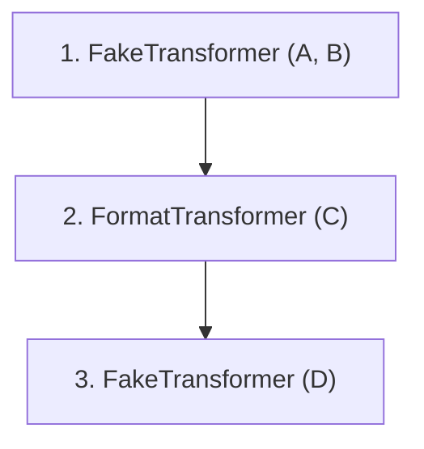

# DtPipe Cookbook

Recipes and examples for common data export and transformation tasks.

**Table of Contents**
- [Basic Usage](#basic-usage)
- [Anonymization (The "Fakers")](#anonymization-the-fakers)
- [Common Transformations](#common-transformations)
- [Advanced Pipelines](#advanced-pipelines)
- [Columnar Transfers & SQL Processors](#columnar-transfers--sql-processors)
- [Standard Streams & Linux Pipes](#standard-streams--linux-pipes)
- [Database Import & Migration](#database-import--migration)
- [Production Automation (YAML)](#production-automation-yaml)
- [Security & Secrets](#security--secrets)

---

## Basic Usage

### Simple Database Export
Export a table from a database to a Parquet file.

```bash
# PostgreSQL → Parquet
dtpipe -i "pg:Host=localhost;Database=prod;Username=postgres" -q "SELECT * FROM users" -o users.parquet
```

### Export to CSV
Use any supported output extension.

```bash
dtpipe -i "pg:Host=localhost;Database=prod;Username=postgres" -q "SELECT * FROM users" -o users.csv
```

### Dry Run (Preview)
Preview data without writing. Validates schema compatibility.

```bash
dtpipe -i "pg:Host=localhost;Database=prod;Username=postgres" -q "SELECT * FROM users" --dry-run 100
```

---

## Anonymization (The "Fakers")

DtPipe maps `--fake` arguments to [Bogus Datasets](https://github.com/bchavez/Bogus).

**Resources:**
- [Available Locales](https://github.com/bchavez/Bogus?tab=readme-ov-file#locales)
- [API Inventory (Datasets)](https://github.com/bchavez/Bogus?tab=readme-ov-file#locales)

### 1. General Usage
The syntax is `--fake "{Column}:{Dataset}.{Method}"`.

#### Personal Information

```bash
dtpipe ... \
  --fake "FirstName:name.firstName" \
  --fake "LastName:name.lastName" \
  --fake "Email:internet.email" \
  --fake-locale fr
```

#### Dates and Numbers

```bash
dtpipe ... \
  --fake "BirthDate:date.past" \
  --fake "Score:random.number"
```

### 2. Deterministic Faking
Use `--fake-seed-column` to guarantee referential integrity across tables.

Instead of a random seed that restarts on each run, this mode hashes a specific column value (e.g. `UserId`) to derive the fake value. The same input value always produces the same output — even across separate runs or if row order changes.

This lets you anonymize `Users` and `Orders` separately while preserving foreign key relationships, as long as both use the same seed column.

```bash
dtpipe ... \
  --fake "Name:name.fullName" \
  --fake-seed-column "UserId"
```

---

## Common Transformations

### 1. Masking Sensitive Strings
Partially hide data.

```bash
# "555-0199" → "555-****"
dtpipe ... --mask "Phone:###-****"

# Masking patterns:
# # - Keep original character
# * - Replace with literal '*' (or any other char)
```

### 2. Overwriting & Nullifying
Hardcode values or erase columns.

```bash
dtpipe ... \
  --overwrite "Status:Archived" \
  --null "Notes"
```

### 3. Formatting Strings
Combine columns using [.NET Composite Formatting](https://learn.microsoft.com/en-us/dotnet/standard/base-types/composite-formatting).

```bash
dtpipe ... --format "DisplayName:{FirstName} {LastName}"
```

---

## Advanced Pipelines

### Pipeline Construction
DtPipe builds the transformation pipeline by scanning CLI arguments left to right. Consecutive arguments of the same type are grouped into a single step.

```
--fake A --fake B --format C --fake D
```

Resulting pipeline:


```mermaid
graph TB
    S1["1. FakeTransformer (A, B)"]
    S2["2. FormatTransformer (C)"]
    S3["3. FakeTransformer (D)"]
    S1 --> S2 --> S3
```

- `--fake "A" --fake "B"` → one Faker step.
- `--fake "A" --format "C" --fake "B"` → three steps (A → Format → B).

### Execution Order
The pipeline executes in the exact left-to-right order of those groups.

```bash
# Anonymize first, then format using the anonymized value
dtpipe ... \
  --fake "Name:name.fullName" \
  --format "Greeting:Hello, {Name}!"
```

Swapping the order would format with the *original* name.

### JavaScript Scripting
Use `--compute` for arbitrary row logic.

**Syntax rules:**
1. **Implicit return**: A single expression without a semicolon is returned automatically.
   - `row.Age > 18` → `return row.Age > 18;`
2. **Explicit return**: Use `return` if your script uses statements or semicolons.
   - `row.Age > 18;` → returns `undefined` (use `return`!)
   - `if (row.Age > 18) return 'Yes';` → works.

```bash
# Simple expression
dtpipe ... --compute "IsAdult:row.Age > 18"

# Complex logic
dtpipe ... \
   --compute "Category:if (row.Age < 18) return 'Minor'; else return 'Adult';"

# Create a new virtual column
dtpipe ... --compute "FullName:row.FirstName + ' ' + row.LastName"
```

> **Tip:** If the column doesn't exist in the input, `--compute` creates it as a virtual column. Use `--compute-types "Col:type"` to set its CLR type (default: `string`).

### Generating Test Data
The `generate:<count>` provider generates rows with a `GenerateIndex` column. Combine it with `--fake` for complete datasets.

```bash
# 1M rows of fake users
dtpipe -i "generate:1000000" \
  --fake "Id:random.number" \
  --fake "Name:name.fullName" \
  --fake "Email:internet.email" \
  --drop "GenerateIndex" \
  -o users.csv
```

### Random Sampling
Use `--sampling-rate` to export a subset of rows.

```bash
# Export 10% of a large table
dtpipe -i "ora:..." -q "SELECT * FROM LargeTable" --sampling-rate 0.1 -o subset.parquet
```

Use `--sampling-seed` to make the selection deterministic (same subset every run).

```bash
dtpipe ... --sampling-rate 0.1 --sampling-seed 12345 ...
```

### Filtering Rows
Drop rows that don't match a JavaScript condition.

```bash
dtpipe ... --filter "row.IsActive && row.Age >= 18"
```

### Row Expansion
Turn a single input row into multiple output rows.

```bash
# If 'Tags' is "A,B,C", this produces 3 rows
dtpipe ... --expand "row.Tags.split(',').map(t => ({ ...row, Tag: t }))"
```

### Window Aggregations (Stateful)
Accumulate rows and process them as a batch.

```bash
# Rolling average over 5 rows
dtpipe ... \
  --window-count 5 \
  --window-script "rows.map(r => ({ ...r, Avg: rows.reduce((s, x) => s + x.Val, 0) / rows.length }))"
```

### External Script Files
Move complex logic to `.js` files to keep your commands readable.

```bash
dtpipe ... --compute "Category:@scripts/categorize_age.js"
```

---

## Columnar Transfers & SQL Processors

### Columnar Fast-Path
When no row-based transformations (JS scripts, fakers) are in the pipeline, DtPipe transfers raw memory buffers directly between columnar formats (Parquet, Arrow, DuckDB) without deserializing rows.

```bash
# Parquet → Arrow (direct buffer transfer)
dtpipe -i data.parquet -o data.arrow
```

### High-Performance Joins (SQL Processors)

Use `--from` + `--sql` to join multiple sources in memory without intermediate files.
The `--from` source is streamed; `--ref` sources are fully preloaded into memory to enable cost-based query planning in both engines.

#### SQL Processor (DuckDB — default)
DuckDB is the default SQL engine. No build step required.

```bash
dtpipe \
  -i "main_data.parquet" --alias main \
  -i "metadata.csv" --alias ref \
  --from main --ref ref \
  --sql "SELECT main.*, ref.name FROM main JOIN ref ON main.id = ref.id" \
  -o "enriched.parquet"
```

#### Choosing a SQL Engine

By default, DtPipe uses **DuckDB** for `--sql` processing. Use `--sql-engine datafusion` or `DTPIPE_SQL_ENGINE=datafusion` to switch to DataFusion (experimental).

| Feature | **DuckDB (Default)** | **DataFusion (Experimental)** |
| :--- | :--- | :--- |
| **Availability** | Always available — no build step. | Requires `./build_experimental.sh` (Rust toolchain needed). |
| **SQL dialect** | Standard SQL, PostgreSQL-compatible, rich function library. | Good coverage, some limitations (e.g. window functions in subqueries). |
| **Testability** | Queries work 1:1 in DuckDB CLI or any BI tool. | Engine-specific — only testable inside DtPipe. |
| **Output path** | DataChunk → Arrow conversion on output (copy). | Arrow-native end-to-end (zero-copy output). |
| **Best for** | All typical ETL/transformation workloads. | High-throughput pipelines (>10M rows) where zero-copy output matters. |

```bash
# Use DataFusion for a specific branch (requires experimental build)
dtpipe \
  -i customers.parquet --alias customers \
  -i orders.csv --alias orders \
  --from orders --ref customers \
  --sql-engine datafusion \
  --sql "SELECT o.*, c.name FROM orders o JOIN customers c ON o.customer_id = c.id" \
  -o result.parquet
```

> **Note:** To verify which engines are available in your build: `dtpipe sql-engines`

#### SQL Dialect Differences (Nested Data)

When working with nested structures (Structs in Arrow, Objects in JSONL), the engines use different syntax for field access:

| Feature | **DataFusion** | **DuckDB** |
| :--- | :--- | :--- |
| **Field Access** | `column['field']` | `column.field` |
| **Nested Access** | `col['nested']['field']` | `col.nested.field` |
| **Quoting** | Optional for common names | Highly recommended for all identifiers |

**Example (JSONL / Nested Structs):**

```bash
# DataFusion Syntax
dtpipe -i data.jsonl --alias m \
  --sql "SELECT m.user['id'], m.meta['details']['code'] FROM m"

# DuckDB Syntax
dtpipe -i data.jsonl --alias m --sql-engine duckdb \
  --sql "SELECT m.user.id, m.meta.details.code FROM m"
```

> **Tip:** If a column name is a reserved SQL keyword (like `group`, `order`), always wrap it in double quotes: `"group".name` or `"group"['id']`.

---

## Standard Streams & Linux Pipes

DtPipe reads from `stdin` and writes to `stdout`, letting you compose it with standard Unix tools.

> **Note:** When using pipes, explicitly specify the format (e.g. `-i csv` or `-o csv`) — there's no file extension to detect.

### Compressed Parquet Output

```bash
dtpipe -i "csv:large_data.csv" -o parquet | gzip > large_data.parquet.gz
```

### Filter with an External Tool, then Anonymize

```bash
duckdb -csv -c "SELECT * FROM 'source.csv' WHERE active=true" | \
  dtpipe -i csv \
  --fake "Name:name.fullName" \
  -o parquet:clean_data.parquet
```

### Streaming JSON Lines to Apache Arrow

```bash
cat server_logs.jsonl | \
  dtpipe -i jsonl \
  --mask "IPAddress:***.***.*.* " \
  -o "arrow:secure_logs.arrow"
```

### Parsing Large XML Files (Streaming)
You can parse massive XML files using an XPath-like selector without loading the entire document into memory. Use `--xml-auto-column-types` to automatically discover all fields and types in a sparse XML.

```bash
# Auto-discover schema and types, then export to PG
cat catalog.xml | \
  dtpipe -i xml \
  --xml-path "//Product" \
  --xml-auto-column-types \
  -o "pg:Host=localhost;Database=prod" \
  --table "Products" --strategy Upsert
```

#### 🏗️ Object Structure & Path Relativity

By default, **DtPipe preserves the document hierarchy**. Unlike CSVs, nested XML or JSON elements are not automatically flattened into the top-level schema. They are instead represented as structured Arrow `StructType` or `ListType` columns.

##### 1. Relative vs Absolute Paths
When using `--xml-column-types`, all paths are **relative to the record node** matched by your `--xml-path`.

```xml
<!-- data.xml -->
<Records>
  <User>
    <Id>123</Id>
    <Profile>
      <Email>a@b.com</Email>
    </Profile>
  </User>
</Records>
```

If you use `--xml-path "//User"`, then:
- Valid path: `Id:int32`
- Valid path: `Profile.Email:string`
- ❌ Invalid path: `User.Id` (redundant)

##### 2. How to Flatten for SQL/CSV
If your target destination (like a CSV file or a standard SQL table) requires a flat structure, you must explicitly "pull" the fields to the top level using a SQL transformer:

```bash
dtpipe -i data.xml --xml-path "//User" \
  --sql "SELECT Id, Profile.Email AS Email FROM row" \
  -o flat_users.csv
```

> [!NOTE]
> This "Object" behavior is identical for both **JSONL** and **XML** readers, ensuring consistency when moving between document formats.


---

## Database Import & Migration

DtPipe writes to DuckDB, SQLite, PostgreSQL, Oracle, and SQL Server using six standardized strategies.

### Write Strategies

| Strategy | Behavior | Use Case |
|:--- |:--- |:--- |
| **Append** (Default) | Inserts rows into the existing table. | Log shipping, daily increments. |
| **Truncate** | Empties the table via `TRUNCATE TABLE`. *(Not available for SQLite)* | Full refresh — preserves schema & indexes. |
| **DeleteThenInsert** | `DELETE FROM` then insert. | When TRUNCATE is unavailable or restricted. |
| **Recreate** | Drops and recreates the table. | Full refresh including schema changes. |
| **Upsert** | Updates existing rows (by PK), inserts new ones. | Syncing where the source is the source of truth. |
| **Ignore** | Inserts new rows, skips existing ones (by PK). | Loading only missing data. |

> **Note for Upsert/Ignore:** Requires a primary key. DtPipe auto-detects it from the target, or you can set it explicitly with `--key "Col1,Col2"`.

### Examples

#### Load Parquet into PostgreSQL (Recreate)

```bash
dtpipe \
  -i data.parquet \
  -o "pg:Host=localhost;Database=prod" \
  --table "public.imported_data" \
  --strategy Recreate
```

#### Append to Oracle

```bash
dtpipe \
  -i "new_sales.csv" \
  -o "ora:Data Source=PROD;..." \
  --table "SALES_DATA" \
  --strategy Append
```

#### Upsert with Explicit Key

```bash
dtpipe \
  -i "orders_update.csv" \
  -o "mssql:Server=.;Database=mydb" \
  --table "Orders" \
  --strategy Upsert \
  --key "OrderId"
```

---

## Production Automation (YAML)

For repeated tasks, define your pipeline in a YAML job file.

### 1. Generate a Job File

```bash
dtpipe -i "ora:..." -q "SELECT..." --fake "..." --export-job nightly_export.yaml
```

### 2. Run the Job

```bash
dtpipe --job nightly_export.yaml
```

### 3. Override at Runtime

```bash
dtpipe --job nightly_export.yaml --limit 50
```

### Example YAML

```yaml
input: ora:Data Source=PROD;User Id=...
query: SELECT * FROM sensitive_table
output: clean_data.parquet

transformers:
  - fake:
      mappings:
        name: name.fullName
        email: internet.email
      options:
        locale: fr
        seed-column: id
```

### Provider Configurations (Reader vs Writer)

Use `provider-options` to supply adapter-specific settings. Append `-writer` to target the output stream specifically.

```yaml
input: input_data.csv
output: export_data.csv

provider-options:
  csv:                 # Applied to the reader (global default)
    separator: ","
    has-header: true
  csv-writer:          # Applied to the writer
    separator: ";"
    quote: "'"
```

### File-to-File (No Query)

When transforming from CSV or Parquet, `query` is optional.

```yaml
input: raw_data.csv
output: clean_data.parquet

transformers:
  - script:
      category: "@scripts/categorize.js"
```

---

## Security & Secrets

### 1. Environment Variables
Standard approach for CI/CD — the shell expands variables before passing them to DtPipe.

```bash
export MY_CONN="ora:Data Source=PROD;User Id=scott;Password=tiger"
dtpipe -i "$MY_CONN" -q "SELECT * FROM users" -o users.parquet
```

### 2. OS Keyring
For local or secure-server use, store credentials in the system keyring (macOS Keychain, Windows Credential Manager, Linux Secret Service). The password never appears in shell history or `ps` output.

**Store the secret once:**
```bash
dtpipe secret set oracle-prod "ora:Data Source=PROD;User Id=scott;Password=tiger"
```

**Reference it by alias:**
```bash
dtpipe -i keyring://oracle-prod -q "SELECT * FROM users" -o users.parquet
```

### 3. Queries from Files
Keep complex or sensitive SQL out of the command line.

```bash
dtpipe -i keyring://prod-db -q "@queries/extract_users.sql" -o users.parquet
```

DtPipe loads the file automatically when `-q` starts with `@` or points to an existing path.
