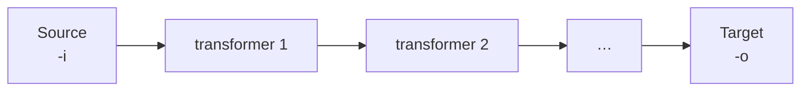
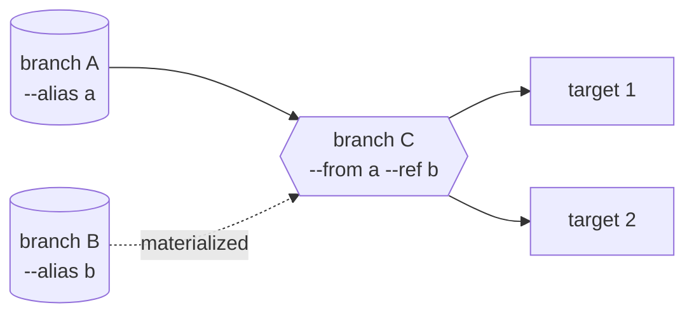

# Concepts

[← Documentation](README.md)

## A pipeline is a source, an ordered chain, a target

A pipeline reads rows from a source, passes them through transformers in the order you wrote them,
and writes them to a target. Nothing is staged in between: there is no temp table, no spool file
and no intermediate copy on disk.



The chain can be empty — `dtpipe -i people.csv -o people.parquet` is a whole pipeline — or carry
as many steps as you write. `dtpipe --help` lists the transformers this binary has; the
[anonymization](guides/anonymization.md) and [SQL and JavaScript](guides/sql-and-javascript.md)
guides cover the ones people reach for most.

A run is a process: it starts, streams, and exits. There is no daemon, no scheduler and no state
server — `cron`, a CI job or an orchestrator decides *when*, dtpipe decides *what*.

## Vocabulary

| Term | What it means |
|:---|:---|
| **Provider** | A reader or a writer for one system — `pg`, `mssql`, `csv`, `s3`. `dtpipe providers` lists the ones your binary carries |
| **Prefix** | The `name:` in front of a connection string. `pg:Host=…` routes to the PostgreSQL provider; `s3://bucket/k.parquet` is a URI, not a prefix, and reaches the provider intact |
| **Transformer** | One step in the chain — `--fake`, `--mask`, `--compute`, `--filter`, `--rename`… Applied left to right |
| **Branch** | One source-to-target path. A command line with one `-i` has one branch |
| **Alias** | A name given to a branch with `--alias`, so another branch can read it |
| **Stream processor** | A step that takes *several* branches as input — `--sql`, which runs on the embedded DuckDB engine, and `--merge` |
| **Job** | A pipeline written as YAML instead of flags, replayable with `--job` |

## Several branches make a DAG

One command line can carry several branches, running concurrently in one process and passing rows
to each other through memory. A branch that declares **no `-o`** publishes its stream under its
alias; a branch that declares one writes to its target and publishes nothing.



That is the whole model: **branches are nodes, `--from` and `--ref` are edges.** From it come the
join (two sources into one processor), the fan-out (one source read once, several consumers), the
merge (`UNION ALL`), and any combination of them. The shapes that already work, with runnable
examples, are in [DAG pipelines](guides/dag.md).

Two edges, two costs:

| Edge | How the data arrives | When to use it |
|:---|:---|:---|
| `--from a` | **Streamed** — batches flow as they are produced | The main input; anything large |
| `--ref b` | **Materialized** — read fully before the query runs | A lookup the query engine needs to plan a real join |

## Order matters, and repetition means something

Transformers run in the order written — each flag adds one step, and every run prints the chain it
built:

```
--fake "name:name.fullName" --fake "email:internet.email" --mask "phone:######****"
→  fake → fake → mask
```

Repeating `-i`, `--from` or `--job` does **not** add a value — it opens a new branch. That is the
one rule that makes a multi-source pipeline expressible on a single command line, and it is why
every other value flag rejects a second occurrence in the same stage instead of silently taking
the last one. A list is therefore comma-separated:

```bash
# Two branches, two independent copies
dtpipe -i sales.csv -o sales.parquet  -i stock.csv -o stock.parquet

--ref a,b        # ✓ one branch reading two lookups
--ref a --ref b  # ✗ refused — repetition means "new branch"
```

A flag also belongs to the **stage** it sits in: reader options go before the alias, writer options
after `-o`. The same flag in two stages is two independent bindings.

## Row mode and columnar mode

Every run prints how the stream travelled:

| Marker | Meaning |
|:---|:---|
| `● row` | Rows move as objects — the shape a database driver and a JavaScript transformer speak |
| `◈ Arrow` | Rows move as Apache Arrow batches — the shape Parquet, DuckDB and the `--sql` processor speak |

dtpipe picks the mode from the components involved and bridges between them when it has to. The
execution plan in a `--dry-run` names the bridges, so a pipeline that pays for a conversion says
so rather than hiding it. That is the cost behind the advice to prefer `--sql` over `--compute`
where both would work — see [SQL and JavaScript](guides/sql-and-javascript.md).

Batches are bounded two ways: `--batch-size` rows (default **32 768**) and, optionally,
`--max-batch-bytes` for rows carrying large text or binary columns. Memory stays flat over any
volume — the engine never holds the whole result, which is also why an operation that must
remember every distinct key (deduplication, a full sort) belongs in `--sql`, where DuckDB can
spill to disk.

## Three ways to express the same pipeline

| Form | Use it for |
|:---|:---|
| **Command line** | Interactive work, one-offs, shell composition (`csv:-` reads stdin, `jsonl:-` writes stdout) |
| **YAML job** (`--job`) | Anything repeatable — version it, review it, run it from CI. `--export-job` converts a command line into one |
| **MCP server / agent** (`dtpipe mcp`, `dtpipe agent`) | Driving dtpipe from an AI assistant, with the write path guarded. See [REFERENCE.md](../REFERENCE.md#model-context-protocol-mcp-server) |

The three share one engine. A YAML job is not a different product with different semantics; it is
the same branch definitions, written down — one top-level key per branch, named by its alias:

```yaml
main:
  input: people.csv
  output: duck:analytics.duckdb
  batch-size: 32768
  sampling-rate: 1
  provider-options:
    duck-writer:
      table: people
```

`--export-job` is the authority on that form: whatever it writes is what the loader reads. See
[YAML jobs](guides/yaml-jobs.md).

## Exit codes

| Code | Meaning |
|:---|:---|
| `0` | Success |
| `1` | Failure — the error names what failed and, where there is one, the rewrite to apply |
| `130` | Cancelled by the user (Ctrl-C), following the POSIX convention |

Cancellation never reports as success: in a multi-branch run, one branch reporting `130` cancels
the rest and the run returns `130`.

---

Next: [Connection catalog](connections/README.md) · [Anonymization](guides/anonymization.md) ·
[DAG pipelines](guides/dag.md)
