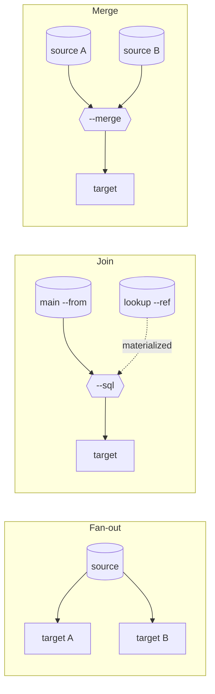

# DAG pipelines: join, merge, fan out

[← Documentation](../README.md)

A command line with one `-i` and one `-o` is one branch. Repeat `-i` and you have several, running
concurrently in one process and exchanging rows through memory — no temp table, no staging file,
no second tool.



## The five words

| Flag | Meaning |
|:---|:---|
| `--alias NAME` | Name this branch so another one can read it |
| `--from A` | Read the stream published by branch `A` |
| `--ref A,B` | Read `A` and `B` as **materialized** lookups — fully loaded before the query runs |
| `--sql "…"` | Run DuckDB SQL over the branches this branch reads |
| `--merge` | `UNION ALL` of every `--from` source |

## Join two sources

```bash
dtpipe -i orders.csv --auto-column-types --alias o \
       -i customers.csv --alias c \
       --from o --ref c \
       --sql "SELECT c.name, sum(o.amount) AS total
              FROM o JOIN c ON o.customer_email = c.email
              GROUP BY c.name ORDER BY total DESC" \
       -o revenue.csv
```

```
╭───────────┬───────────┬──────┬───────┬─────────╮
│ Branch    │ Stage     │ Rows │ Speed │ Mode    │
├───────────┼───────────┼──────┼───────┼─────────┤
│ [o]       │ ▸ Reading │    3 │ 238/s │ ● row   │
│ [c]       │ ▸ Reading │    2 │ 157/s │ ● row   │
│ [stream1] │ ▸ Reading │    2 │ 208/s │ ◈ Arrow │
╰───────────┴───────────┴──────┴───────┴─────────╯
```

```
name,total
Alice,165
Bob,80
```

An alias is a table name inside the query. The sources can be anything dtpipe reads — a CSV joined
against an Oracle table joined against a Parquet file on S3.

> [!NOTE]
> `--from` **streams**; `--ref` is **materialized** — read fully into memory so the query engine
> can plan a real join. Filter a large lookup upstream before making it a `--ref`.

## Fan one source out to several targets

The source is read **once** and broadcast:

```bash
dtpipe -i people.csv --alias s \
       --from s -o all.parquet \
       --from s --sql "SELECT city, count(*) AS n FROM s GROUP BY city ORDER BY n DESC LIMIT 5" \
       -o top_cities.csv
```

```
│ [s]       │ ▸ Reading │ 1,000 │ 64.1K/s │ ● row   │
│ [stream1] │ ▸ Reading │ 1,000 │ 40.1K/s │ ◈ Arrow │
│ [stream2] │ ▸ Reading │     5 │   550/s │ ◈ Arrow │
```

One read of the source, a full copy to one target and an aggregate to another, concurrently.

## Merge several sources

```bash
dtpipe -i sales_2025.parquet --alias a \
       -i sales_2026.parquet --alias b \
       --from a,b --merge -o sales_all.parquet
```

## The rules that catch people out

**Repeating `-i`, `--from` or `--job` opens a new branch.** That is the only way a single command
line can express several paths, and it is why an alias list is comma-separated:

```bash
--ref a,b        # ✓ one branch reading two lookups
--ref a --ref b  # ✗ refused — repetition means "new branch", not "add to the list"
```

**A branch is readable only while it has no output of its own.** A branch publishes its stream to
the others exactly when it declares no `-o`. One that writes to a target publishes nothing, and
naming it in `--from`/`--ref` is refused at validation. A table that must be both written *and*
joined on therefore takes two branches — one that produces it, one that writes it — plus the branch
that joins. The recipe is in
[COOKBOOK.md](../../COOKBOOK.md#generating-two-related-tables).

**`--from` arity belongs to the processor, not the grammar.** `--merge` takes several sources;
`--sql` streams exactly one and materializes the rest through `--ref`, so `--from a,b --sql` is
refused with the rewrite to apply.

**A flag belongs to the branch and stage it sits in.** Reader options go before the alias, writer
options after `-o`. The same flag in two different stages is two independent bindings; the same
flag twice in one stage is a hard error rather than a silent last-wins.

## Topologies that already work

| Shape | Pattern |
|:---|:---|
| Linear | `-i src -o dst` |
| Two independent copies | `-i src1 -o dst1  -i src2 -o dst2` |
| SQL over one source | `-i src --alias a  --from a --sql "…" -o dst` |
| Join (main + lookup) | `-i main --alias m  -i ref --alias r  --from m --ref r --sql "…"` |
| Merge (UNION ALL) | `-i a --alias a  -i b --alias b  --from a,b --merge -o dst` |
| Fan-out | `-i src --alias s  --from s -o dstA  --from s -o dstB` |
| Diamond | `-i src --alias s  --from s --filter '…' --alias hi  --from s --filter '…' --alias lo  --from hi --ref lo --sql "…"` |
| Join then fan-out | `… --from m --ref r --sql "…" --alias j  --from j -o dstA  --from j -o dstB` |

## In YAML

Every shape above survives `--export-job`, which is the quickest way to learn the file form:

```yaml
o:
  input: orders.csv
  provider-options:
    csv-reader:
      auto-column-types: true
c:
  input: customers.csv
stream1:
  from: o
  ref:
  - c
  output: revenue.csv
  provider-options:
    sql:
      query: SELECT c.name, sum(o.amount) AS total FROM o JOIN c ON o.customer_email = c.email GROUP BY c.name
```

---

See also: [SQL and JavaScript](sql-and-javascript.md) · [YAML jobs](yaml-jobs.md) ·
[COOKBOOK.md](../../COOKBOOK.md#dag-pipelines-multi-source) ·
[REFERENCE.md](../../REFERENCE.md#dag-syntax)
