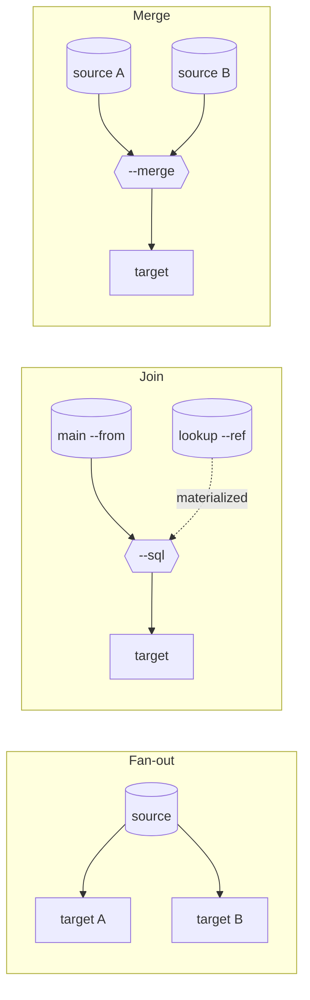

# DAG pipelines: join, merge, fan out

[← Documentation](../README.md)

A command line with one `-i` and one `-o` is one branch. Repeat `-i` and you have several, running
concurrently in one process and exchanging rows through memory — no temp table, no staging file,
no second tool.



## The five words

| Flag | Meaning |
|:---|:---|
| `--alias NAME` | Name this branch so another one can read it |
| `--from A` | Read the stream published by branch `A` |
| `--ref A,B` | Read `A` and `B` as **materialized** lookups — fully loaded before the query runs |
| `--sql "…"` | Run DuckDB SQL over the branches this branch reads |
| `--merge` | `UNION ALL` of every `--from` source |

## The data used below

Every example on this page runs against these three files, so the shapes can be read one after the
other without changing dataset.

`orders.csv`

```
order_id,customer_email,amount
10,alice@corp.com,120
11,bob@corp.com,80
12,alice@corp.com,45
```

`customers.csv`

```
id,email,name
1,alice@corp.com,Alice
2,bob@corp.com,Bob
```

`orders_2025.csv`

```
order_id,customer_email,amount
7,alice@corp.com,200
8,bob@corp.com,150
```

## Join two sources

```bash
dtpipe -i orders.csv --auto-column-types --alias o \
       -i customers.csv --alias c \
       --from o --ref c \
       --sql "SELECT c.name, sum(o.amount) AS total
              FROM o JOIN c ON o.customer_email = c.email
              GROUP BY c.name ORDER BY total DESC" \
       -o revenue.csv
```

The panel every run prints is the DAG it built — one block per branch, with what each one reads:

```
╭─ Pipeline ───────────────────────────────────────────────────────────────╮
│   ◉ [o]  →  [stream1]                                                    │
│       ← orders.csv  ◈ Arrow                                              │
│                                                                          │
│   ◉ [c]  →  [stream1]                                                    │
│       ← customers.csv  ◈ Arrow                                           │
│                                                                          │
│  ⚡ [stream1]  ← [o]  +ref [c]                                           │
│       SQL › SELECT c.name, sum(o.amount) AS total FROM o JOIN c ON o.... │
│       ──▶  revenue.csv                                                   │
╰──────────────────────────────────────────────────────────────────────────╯
```

`revenue.csv`

```
name,total
Alice,165
Bob,80
```

An alias is a table name inside the query. The sources can be anything dtpipe reads — a CSV joined
against an Oracle table joined against a Parquet file on S3.

> [!NOTE]
> `--from` **streams**; `--ref` is **materialized** — read fully into memory so the query engine
> can plan a real join. The panel spells the difference: `← [o]` for the streamed input, `+ref [c]`
> for the materialized one. Filter a large lookup upstream before making it a `--ref`.

> [!IMPORTANT]
> `--auto-column-types` on the orders reader is what makes `sum(amount)` work. A CSV column is
> text until something says otherwise, and `sum(VARCHAR)` has no meaning — see
> [Files](../connections/files.md).

## Fan one source out to several targets

The source is read **once** and broadcast — a full copy to one target and an aggregate to another,
concurrently:

```bash
dtpipe -i orders.csv --auto-column-types --alias s \
       --from s -o orders.parquet \
       --from s --sql "SELECT customer_email, sum(amount) AS total
                       FROM s GROUP BY customer_email ORDER BY total DESC" \
       -o totals.csv
```

```
╭─ Pipeline ───────────────────────────────────────────────────────────────╮
│   ◉ [s]  →  [stream1], [stream2]                                         │
│       ← orders.csv  ◈ Arrow                                              │
│                                                                          │
│   ◉ [stream1]  ← [s]                                                     │
│       ──▶  orders.parquet                                                │
│                                                                          │
│  ⚡ [stream2]  ← [s]                                                     │
│       SQL › SELECT customer_email, sum(amount) AS total FROM s GROUP ... │
│       ──▶  totals.csv                                                    │
╰──────────────────────────────────────────────────────────────────────────╯
```

`totals.csv`

```
customer_email,total
alice@corp.com,165
bob@corp.com,80
```

The `→ [stream1], [stream2]` on the source branch is the broadcast. The row counts in the results
table show it too: the source reads its rows once, and each consumer receives them all.

## Merge several sources

```bash
dtpipe -i orders_2025.csv --auto-column-types --alias a \
       -i orders.csv --auto-column-types --alias b \
       --from a,b --merge -o orders_all.csv
```

```
╭─ Pipeline ───────────────────────╮
│   ◉ [a]  →  [stream1]            │
│       ← orders_2025.csv  ◈ Arrow │
│                                  │
│   ◉ [b]  →  [stream1]            │
│       ← orders.csv  ◈ Arrow      │
│                                  │
│  ⚡ [stream1]  ← [a]  +from [b]  │
│       merge                      │
│       ──▶  orders_all.csv        │
╰──────────────────────────────────╯
```

`orders_all.csv`

```
order_id,customer_email,amount
7,alice@corp.com,200
8,bob@corp.com,150
10,alice@corp.com,120
11,bob@corp.com,80
12,alice@corp.com,45
```

Both inputs are streamed — `← [a]  +from [b]`, where the join above read `+ref [c]`.

> [!NOTE]
> `--merge` is a `UNION ALL` of branches that run **concurrently**, so it guarantees which rows
> come out, not the order they come out in. Add an `--sql` stage with an `ORDER BY` if something
> downstream depends on it.

## The rules that catch people out

**Repeating `-i`, `--from` or `--job` opens a new branch.** That is the only way a single command
line can express several paths, and it is why an alias list is comma-separated:

```bash
--ref a,b        # ✓ one branch reading two lookups
--ref a --ref b  # ✗ refused — repetition means "new branch", not "add to the list"
```

**A branch is readable only while it has no output of its own.** A branch publishes its stream to
the others exactly when it declares no `-o`. One that writes to a target publishes nothing, and
naming it in `--from`/`--ref` is refused at validation. A table that must be both written *and*
joined on therefore takes two branches — one that produces it, one that writes it — plus the branch
that joins. The recipe is in
[SQL and JavaScript](sql-and-javascript.md).

**`--from` arity belongs to the processor, not the grammar.** `--merge` takes several sources;
`--sql` streams exactly one and materializes the rest through `--ref`, so `--from a,b --sql` is
refused with the rewrite to apply.

**A flag belongs to the branch and stage it sits in.** Reader options go before the alias, writer
options after `-o`. The same flag in two different stages is two independent bindings; the same
flag twice in one stage is a hard error rather than a silent last-wins.

## Topologies that already work

| Shape | Pattern |
|:---|:---|
| Linear | `-i src -o dst` |
| Two independent copies | `-i src1 -o dst1  -i src2 -o dst2` |
| SQL over one source | `-i src --alias a  --from a --sql "…" -o dst` |
| Join (main + lookup) | `-i main --alias m  -i ref --alias r  --from m --ref r --sql "…"` |
| Merge (UNION ALL) | `-i a --alias a  -i b --alias b  --from a,b --merge -o dst` |
| Fan-out | `-i src --alias s  --from s -o dstA  --from s -o dstB` |
| Diamond | `-i src --alias s  --from s --filter '…' --alias hi  --from s --filter '…' --alias lo  --from hi --ref lo --sql "…"` |
| Join then fan-out | `… --from m --ref r --sql "…" --alias j  --from j -o dstA  --from j -o dstB` |

## In YAML

Every shape above survives `--export-job`, which is the quickest way to learn the file form. This
is the join, exported verbatim:

```yaml
o:
  input: orders.csv
  batch-size: 32768
  sampling-rate: 1
  provider-options:
    csv-reader:
      auto-column-types: true
c:
  input: customers.csv
  batch-size: 32768
  sampling-rate: 1
stream1:
  from: o
  ref:
  - c
  output: revenue.csv
  batch-size: 32768
  sampling-rate: 1
  provider-options:
    sql:
      query: SELECT c.name, sum(o.amount) AS total FROM o JOIN c ON o.customer_email = c.email GROUP BY c.name ORDER BY total DESC
```

The branch names on the left are the aliases, and `stream1` is the one the CLI generated for the
`--sql` stage. See [YAML jobs](yaml-jobs.md).

## When something does not behave

| Symptom | Where it is explained |
|:---|:---|
| `sum(VARCHAR)` has no meaning | [Files](../connections/files.md) — a CSV column is text until typed |
| `--ref a --ref b` refused | The repetition rule above |
| A branch cannot be read by another | It declares an `-o` of its own — see the rule above |
| A flag appears to be ignored | It landed in the wrong stage — the refusal names the stage that carries it |

---

See also: [SQL and JavaScript](sql-and-javascript.md) · [YAML jobs](yaml-jobs.md) ·
[Troubleshooting](../troubleshooting.md) · [REFERENCE.md](../../REFERENCE.md#dag-syntax)
