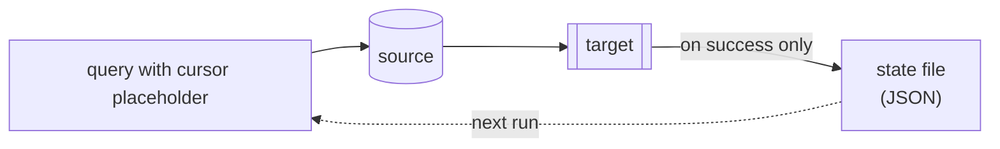

# Incremental loading

[← Documentation](../README.md)

Transfer only what changed. dtpipe tracks the highest value it saw in a column, writes it to a
state file after a **successful** run, and lets the next run read it back into the query.



## Two flags that track, one resolver that filters

The split matters more than the count: the flags record the mark, and **nothing filters until the
resolver is in the query**. A run carrying only the two flags reads its whole source every time
and says so — see the warning below.

| Piece | Role |
|:---|:---|
| `--cursor COLUMN` | The column to watch. Name it **as the reader returns it** — upper case for an unquoted Oracle identifier |
| `--state PATH` | Where the mark is persisted. There is **no default path** |
| `${{cursor://PATH\|DEFAULT}}` | **In the query** — this is what filters. `PATH` is the same file `--state` names; `DEFAULT` is what the first run uses, before any state file exists |
| `--cursor-from VALUE` | Optional. Ignore the state file for this run and start from here — for a backfill or a replay |

> [!IMPORTANT]
> **The two flags go together, and the resolver goes with both.** `--cursor` without `--state`
> is refused before anything runs, and so is the reverse. The pair **without** the resolver is
> accepted and warns — *« sets 'cursor: …', but no `${{cursor://…}}` appears »* — because it
> tracks correctly and filters nothing: every run re-reads the whole source, and the mark it saves
> is never read back.

The path inside the resolver is the same file `--state` names — **write it twice**, or the query
reads a mark nothing updates and the run silently re-reads everything.

```bash
dtpipe -i "pg:Host=prod;Database=app;Username=app" \
  --query "SELECT * FROM orders
           WHERE updated_at > '${{cursor://state/orders.json|1970-01-01T00:00:00.000}}'" \
  -o "sqlite:Data Source=dw.db" --table orders --strategy Append \
  --cursor updated_at --state state/orders.json
```

## The state file

Plain JSON — readable, diffable, and safe to commit or to keep in a mounted volume:

```json
{
  "version": 1,
  "cursor": { "column": "updated_at", "value": "2026-06-15T23:59:59.000", "type": "datetime" },
  "last_run": {
    "started_at": "2026-06-16T02:00:00Z",
    "completed_at": "2026-06-16T02:03:42Z",
    "rows_transferred": 1234,
    "status": "success"
  }
}
```

The mark advances only on success, so a failed run re-reads the same window rather than skipping
it.

## Things that bite

**Strict `>` versus `>=`.** With `>`, a row whose timestamp equals the mark is never picked up
again — losing rows written in the same instant as the last one read. With `>=`, the boundary rows
are re-read and re-written each run, which is only safe with `--strategy Upsert`. Pick the pair
deliberately: `>` + `Append`, or `>=` + `Upsert`.

**Oracle needs a format mask.** A `TIMESTAMP` compared against a bare literal is parsed with the
session's `NLS_TIMESTAMP_FORMAT`, which is not the format the state file writes. Wrap it in
`TO_TIMESTAMP(…, 'YYYY-MM-DD"T"HH24:MI:SS.FF3')` — see [Oracle](../connections/oracle.md).

**One writer, one state file.** Two branches writing the same state file would corrupt each
other's cursor, so the DAG validator refuses it before anything runs.

**A clock is not a sequence.** A monotonic id (`id > mark`) is immune to clock skew and to rows
inserted with an older timestamp; a timestamp column is not. Where both exist, prefer the id.

## In a YAML job

```yaml
main:
  input: "pg:Host=localhost;Database=prod"
  output: "sqlite:Data Source=dw.db"
  cursor: "updated_at"
  state: "state/orders_sync.json"
  provider-options:
    pg-reader:
      query: "SELECT * FROM orders WHERE updated_at > '${{cursor://state/orders_sync.json|1970-01-01T00:00:00.000}}'"
```

---

See also: [Write strategies](write-strategies.md) · [YAML jobs](yaml-jobs.md) ·
[REFERENCE.md](../../REFERENCE.md#incremental-loading)
