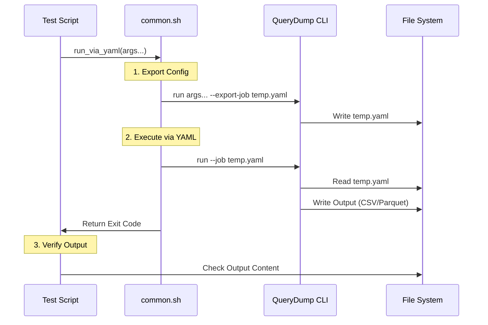

# Integration Tests

This document describes the integration validation scripts located in `tests/scripts/`. These scripts verify the end-to-end functionality of QueryDump, ensuring that CLI arguments, YAML configuration, and core features work as expected.

## Overview

The integration tests are Bash scripts that:
1.  Build the project in Release mode.
2.  Generate input test data.
3.  Run various `querydump` commands.
4.  Verify the output (exit codes, file content, data accuracy).
5.  **Crucially**: Verify the CLI-to-YAML export loop to ensure full configuration persistency.

## Test Scripts

| Script | Purpose |
|--------|---------|
| `common.sh` | Shared helper functions, including the core `run_via_yaml` logic. |
| `validate_project.sh` | Tests the `--project` (whitelist) and `--drop` (blacklist) transformers. |
| `validate_transformers.sh` | Tests data transformers (`--overwrite`, `--null`, `--mask`, etc.). |

## Validation Logic (`run_via_yaml`)

To ensure robust configuration support, we use a wrapper function `run_via_yaml` instead of running `querydump` directly. This tests not just the execution, but the ability to **save and restore** the configuration.

### Flow Diagram



### Why this approach?

1.  **CLI Verification**: The first step (export) proves that CLI parsing works and that all arguments are correctly mapped to internal configuration objects.
2.  **Serialization Verification**: The export process proves that the internal configuration can be correctly serialized to YAML.
3.  **Deserialization Verification**: The second step (run) proves that the YAML can be correctly parsed back into a valid job.
4.  **Runtime Verification**: The final execution proves the core logic (readers, transformers, writers) works as intended.

## Adding a New Test

To add a new integration test:

1.  Create a new script (e.g., `validate_new_feature.sh`) or add to an existing one.
2.  Source `common.sh`:
    ```bash
    source "$SCRIPT_DIR/common.sh"
    ```
3.  Use `run_via_yaml` for any execution you want to verify via the config loop:
    ```bash
    run_via_yaml --input "..." --query "..." --output "..." --new-feature "value"
    ```
4.  Add manual assertions (grep, wc, diff) to verify the output file.
